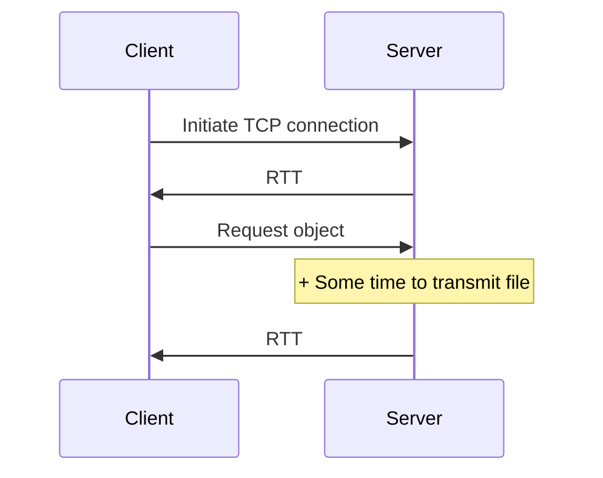

# CSS 118 Notes

<!-- vim: set spell: -->

<!-- Lecture 1 -->

## What is the Internet?

- Three components:
  - Hosts (end systems)
  - Communication links
    - Fiber optics cables, radio, etc.
    - **NOTE:** The transition rate is called _bandwidth_
  - Routers and switches
    - **NOTE:** _Packet switching_ means forwarding packets of data
- Network structure:
  - Network edge
    - Internet boundaries, client and server hosts
      - Access networks like home Wi-Fi, DSL, cable network, Ethernet, cellular,
        etc.
  - Network core
    - Internet backbone of interconnected routers

### How are access networks constructed in the first place?

- Signals carried by EM waves (radio) or within wires (Ethernet)
- Network core will move bits around access networks to the destination, using
  routers
- Router functions:
  - Routing: determines source-destination route taken by _data routing
    algorithms_
  - Forwarding: moves data from router's input to appropriate router output

### How can the Internet grow so big?

- Connecting all access ISPs to each other does not scale ($O(n^{2})$
  connections)
- Connect all to a global ISP is bad because if the main fails, everything fails
  - Also bad for business as one company will control all traffic
- Connecting to multiple global ISPs reduces work load and is more reliable
- Creating a hierarchical structure is even better as it reduces load and allows
  for regional ISPs

### What is the Internet software architecture?

- It is complex:
  - Many difference pieces running in different places
- But simple:
  - All pieces adhere to simple rules
- Rules:
  - Enabling rules
    - Packet switching:
      - Breaking up load into smaller packets
      - Packets are labeled with a number to denote order
      - Packets are transmitted at _full link speed_

<!-- Discussion 1 -->

## Client-server model

- Asymmetric communication model
  - Client requests data:
    - Initiates communication
    - Waits for server response
  - Server (Daemon) responds to requests:
    - Discoverable by clients (e.g. IP address & port)
    - Waits for client connection
    - Processes requests, sends replies
- Clients and servers are programs at the **application layer**

### TCP: Transmission Control Protocol

- A connection is set up between client and server
- Reliable data transfer
  - Guaranteed deliveries of all data
  - No duplicate data will be delivered
- Data will always be received in the order it is sent
- Full-duplex byte stream (in two directions simultaneously)
- Regulated data flow with flow control and congestion control

### UDP: User Data Protocol

- Basic transmission service
  - No connection needed
  - Unit of data transfer: datagram (variable length)
- No reliability guarantee
- No ordered deliver guarantee
- No flow control / congestion control

### Socket APIs

- Socket:
  - An endpoint in inter-process communication across a computer network
  - TCP sockets have tuples of `<ip_addr:port>`
  - On Linux and MacOS, sockets are like files (socket handles are file
    descriptors)
  - TCP sockets provide `write()` and `read()` for sending and receiving data
- Socket port numbers
  - Smaller numbers are reserved and only accessible by super-users

### Caveat: Byte ordering matters

- Data that is sent in little-endian must be read as such, and vice versa
- The API defines methods to convert to proper network ordering
  - This only works for 16- and 32-bit data, more complex data types must be
    taken into account differently

<!-- Lecture 2 -->

### Packet switching

- **Store-and-forward** operations inside the network
- Sending host
  - Takes application message

### Circuit switching

- End-end resources are allocated and reserved for a voice call between source
  and destination
- `FDM`
  - `FDM` does one user at a time
  - `TDM` alternates users over time

### Packet switching vs. Circuit switching

- Packet switching allows more users in the network
- Example: 1 Mb/s link, where each user needs 100 Kb/s when active, and users
  are active 10% of the time.
  - Max supported users:
    - Circuit switching: 10
    - Packet switching: with `N` users, probability that more than 10 users are
      active at a time is less than 0.004. `N` must be:
      - Each user is active with probability 10%
      - $P(N, x) = \begin{pmatrix} N\\x \end{pmatrix} p^{x}(1-p)^{N-x}$
      - $\sum_{x=0}^{10} P(N, x) \ge 1 - 0.04\%$
      - $N = 35$

## What is the Internet Service Model?

- Internet best effort service model
  - Arguably the simplest service model
    - Only promise is to try its best
  - Does not guarantee anything, not even:
    - Successful packet delivery
    - Timing or in-order delivery
    - Minimum throughput/speed to deliver data

### Internet software appears in the form of protocols

- Protocols control sending and receiving messages
  - E.g. HTTP, Skype, TCP, etc.
- Protocols are software pieces
  - There are 100s\~100s of them
- Organized in layers which cannot only talk to the immediate upper or lower
  layer

### Layering

- Modularization allows for easier maintenance
- Different layers have their own protocols

#### Layers

- **Application:** Supports network applications
  - FTP, SMTP, HTTP
- **Transport:** Process-to-process data transfer
  - TCP, UDP
- **Network:** Routing of datagrams from source to destination
  - IP, routing protocols
- **Link:** Data transfer between neighboring network elements
  - Ethernet, Wi-Fi, PPP
- **Physical:** Bits "on the wire"

### How to evaluate the Internet

Performance is gauged with three metrics:

#### Throughput

- Throughput is the rate (bits/time) at which units are transferred
- End-to-end throughput is equivalent to the bottleneck throughput

#### Packet Loss

- Queue preceding link in buffer has finite capacity
- Packet arriving to full queue dropped
- Lost packet may be retransmitted by previous node, by source end system, or
  not at all

#### Delay

- Host sending function:
  - Takes application message
  - Breaks it into smaller chunks, called packets, of length `L` bits
  - Transmits packets across network at rate `R`
  - Packet transmission delay $= \frac{L}{R}$

##### Packet Delay

If arrival rate (in bits) to link exceeds transmission rate for a period of
time:

- Packets will queue and wait to be transmitted on the link
- Packets can be dropped (lost) if memory (buffer) fills up

###### Four Sources of Packet Delay

- $d_{proc}$: Nodal processing
  - Check bit errors
  - Determine output link
  - Typically < milliseconds
- $d_{queue}$: Queuing delay
  - Time waiting at output link for transmission
  - Depends on congestion of router
- $d_{trans}$: Transmission delay
  - L: Packet length (bits)
  - R: Link bandwidth (bps)
  - $d_{trans} = \frac{L}{R}$
- $d_{prop}$: Propagation delay
  - d: Length of physical link
  - s: Propagation speed
  - $d_{prop} = \frac{d}{s}$

<!-- Lecture 3 -->

## Application Layer

### Creating a network app

- We need to incorporate different machines communicating across the Internet
- We can do this several ways:
  - Client-server paradigm
    - Server
      - Always-on host
      - Has a permanent IP address
      - Often used in data centers for scaling
    - Clients
      - Communicate with the server
      - May be intermittently connected
      - Can have dynamic IP addresses
      - Do _not_ communicate directly with each other
    - Examples: HTTP, FTP
  - Peer-to-peer architecture
    - Each peer is a client _and_ server
      - Peers request services from each other in exchange for providing service
        to one another
    - Self-scalable architecture; more users means more demand but also more
      supply
    - Peers are intermittently connected and change IP addresses
      - No always-on server

### Communication across network

#### Processes

- A program running within a host
  - Client process initiates communication
  - Server process awaits communication
- To receive messages, processes must have an _identifier_
  - Identifier includes IP address and port number
    - IP address is not enough! Many processes can run on one host.

#### Sockets

- Sockets are where processes send and receive messages to and from
- Analogous to doors
- There will be one socket on each side of communication
- Sockets can use different transport services

#### Transport services

- UDP
  - Connectionless: no connection setup
  - Unreliable data transfer
  - No rate control
    - You control the sending rate
  - No guarantees on:
    - Reliability, flow control, congestion control, timing, throughput,
      security
- TCP
  - Connection oriented: setup required between client and server processes
  - Reliable transfer between client and server
  - Automated rate control:
    - Flow control: sender won't overwhelm receiver
    - Congestion control: throttle sender when the network is overloaded
  - No guarantees on:
    - Timing, minimum throughput, security

#### Transport service choices across applications

| Application            | Application Layer Protocol | Transport Protocol |
| ---------------------- | -------------------------- | ------------------ |
| File transfer/download | FTP                        | TCP                |
| E-mail                 | SMTP                       | TCP                |
| Web documents          | HTTP 1.1                   | TCP                |
| Internet telephony     | SIP, RTP, or proprietary   | TCP or UDP         |
| Streaming audio/video  | HTTP, DASH                 | TCP                |
| Interactive games      | WOW, FPS (proprietary)     | UDP or TCP         |

### Web applications

#### What paradigm?

Client-server

#### What content?

- Web pages
  - Organized as many objects which can be stored on different web servers
  - One base-HTML file, referencing other objects by URL

#### How to transfer?

HTTP connections

##### HTTP Overview

- Hypertext Transfer Protocol
- The Web's application layer protocol
- Uses client/server model
  - Stateless: server maintains no information about past client requests
- Uses TCP
- Two types of connection
  - Non-persistent HTTP
    - TCP connection opened
    - At most _one_ object sent over the connection
    - TCP connection closed
  - Persistent HTTP
    - TCP connection opened to a server
    - _Multiple_ objects can be sent over the single connection between the
      client and that server
    - TCP connection closed

###### Non-persistent HTTP

Requires two `RTT`s (round trip times) per object, one to establish connection
and another to send the object over it.

> **NOTE:** There is a variation on this called **Parallel Non-persistent
> HTTP**, which uses one TCP connection and then multiple parallel requests to
> fetch referenced objects. The downside is that it uses more server (OS)
> resources.

###### Persistent HTTP

Main idea is to reuse the same TCP connection for multiple objects. Only
requires one `RTT` for each referenced object.

###### Non-persistent vs. Persistent

Example: 10 small, referenced objects

| Non-persistent HTTP | Persistent HTTP | Non-persistent HTTP (5 objects in parallel) |
| :-----------------: | :-------------: | :-----------------------------------------: |
| 2 + 2\*10 = 22 RTT  | 2 + 10 = 12 RTT |              2 + 2 + 2 = 6 RTT              |

> **NOTE:** Each requires an initial 2 `RTT` to get data from the DOM.

For the last case (five objects in parallel):

1. First two `RTT`s are for setting up connection and requesting DOM data.
2. Next two `RTT`s are for requesting the first five objects (limit determined
   by parallel requests).
3. Last two `RTT`s are for requesting the last five objects.

<!-- Discussion 2 -->

### Practice

#### a)

**Q:** What is the propagation delay of a packet of length 1000 bytes sent over
a link of distance 2500km, propagation speed $2.5x10^8$ m/s, and transmission
rate 2 Mbps?

**A:** `TBD`

#### b)

**Q:** Suppose host A wants to send a large file to host B. The path from Host A
to Host B has three hops on the link, the data rates are: $R_1$ = 500Kbps, $R_2$
= 2Mbps, and $R_3$ = 1Mbps.

- Assuming no other traffic in the network, what is the throughput for the file
  transfer?
  - **A:** 500 kbps
- Suppose the file is 4 million bytes. Roughly how long will it take to transfer
  the file to Host B?
  - **A:** (4 / 0.5) \* 8 = 64 seconds
    - We multiply by 8 due to the conversion from bytes to bits
- Suppose the file is 200 bytes and it is segmented into two 100 byte packets.
  Also $R_2$ transfer speed has been reduced to 100Kbps. What is the queuing
  delay for the second packet at host A, the first node, and the second node?
  - **A:** At the sender node, it is 1.6 ms (the time it takes for the first
    packet to be sent across $R_1$). The second packet will have queuing delay
    at the first node since $R_2$ is now the bottleneck (first packet will not
    finish transmitting by the time the second packet arrives). At the first
    node the queuing delay will be 6.4ms. The second node will have no queuing
    delay as the first packet will be long gone before the second packet arrives
    at the link.

#### c)

**Q:** When you need to retrieve a web document from an HTTP server with an
_unknown_ IP address, what protocol should you use?

**A:** You must use DNS for if you do not know the IP address (for the
application layer). For the transport layer, you use UDP with DNS and TCP for
HTTP.

### Application Layer Models

- Application architectures
  - Client-server
  - Peer-to-peer
  - Hybrid
    - Skype (TCP & UDP)
    - `GTalk` (TCP & UDP)

### Application Layer Protocols

- HTTP: stateless protocol on top of TCP
  - HTTP is fundamentally based on pull model
  - Persistent vs. Non-persistent
  - Method types: `GET`, `HEAD`, `POST`, `PUT`, `DELETE`, Conditional `GET`
  - What if we want a stateful service (e.g. a web cart that remembers your
    items)?
    - Web caches (proxy server) with cookies e.g.

<!-- Lecture 4 -->

### HTTP Messages

There are two types, both with headers terminated by an empty line of `\r\n`:

#### Request Message

- In ASCII (human-readable format)
- Take various forms
  - `POST`
    - Web pages often includes form input
    - User input sent from the client to the server in the body of the `POST`
      request
  - `GET`
    - Can include user data in the URL field of the message following a `?`
      - E.g. `www.somesite.com/animalsearch?monkeys&banana`
  - `HEAD`
    - Requests headers (only) that would be returned _if_ the specified URL were
      requested with a `GET` method
  - `PUT`
    - Uploads a new file (object) to the server
    - Completely replaces file that exists at the specified URL with content in
      the body of the `POST` request message

#### Response Message

- Similar looking body to request message
- Contains status codes
  - `200`: OK
  - `301`: Moved Permanently
  - `400`: Bad Request
  - `404`: Not Found
  - `505`: Unsupported HTTP Version

### HTTP Web Advanced Features

#### Web cookies

- **Recall:** HTTP `GET` / response interaction is _stateless_
  - No need for client / server to track state of multi-step exchange
  - No need for client / server to recover from partially completed transactions
- Cookies maintain user / server state

#### Web caches (proxy servers)

- **Goal:** satisfy client request without involving origin server
- User configures browser to point to a web cache (i.e., proxy server)
- Browser sends all HTTP requests to the cache:
  - _If_ the object is in the cache: Cache returns the object to the client
  - _Else_ the cache requests the object from the origin server, caches the
    received object, then returns the object to the client

#### Conditional `GET`

- **Goal:** Don't send object if cache has up-to-date cached version
  - No object transmission delay
  - Lower link utilization
- Cache: specify date of cached copy in HTTP request
  - `if-modified-since: <date>`
- Server: response contains no object if cached copy is up-to-date
  - `HTTP/1.0 304 Not Modified`

#### HTTP/2

- **Goal:** Decrease delay in multi-object HTTP requests
- HTTP/1.1 introduced multiple, pipelined `GET`s over a single TCP connection
- HTTP/2 migrates head-of-line blocking
  - Smaller objects will not have to wait behind previous, larger objects which
    are taking longer to download
- Allows for this by dividing objects into frames and interleaving the frame
  transmission
  - Smaller objects are delivered very quickly and initial, large objects are
    slightly delayed
- Recovery from packet loss still stalls all object transmissions
- No security via vanilla TCP connection

#### HTTP/3

- **Goal:** Same as HTTP/2
- Adds security, per-object error- and congestion-control (more pipe-lining)
  over UDP
  - More on this in the transport layer section

### Internet Application: E-mail

- Mail servers
  - Includes a mailbox containing incoming messages from the user
  - Also includes a message queue of outgoing (to be sent) mail messages
- App-layer protocol: SMTP (simple mail transfer protocol)
  - Used between mail servers to send email messages
  - Client: sending mail server
  - "Server": receiving mail server
- Uses TCP for reliable transfer
- Three transfer phases
  - Handshaking (greeting)
  - Transfer of messages
  - Closure

<!-- Lecture 5 -->

### Domain Name System (DNS)

Provides lookup from domain name (e.g. `www.google.com`) to IP address
(`173.194.204.99`)

#### DNS Services

- Host name to IP address translation
- Host aliasing
  - Canonical, alias names
- Mail server aliasing
- Load distribution
  - Replicated web servers: many IP address correspond to one name

> **Q:** Why not centralize DNS?

- Single point of failure
- Traffic volume
- Distant centralized database
- Maintenance
- Doesn't scale

#### DNS Structure

- Internet distributed database implemented in hierarchy of many name servers
- Application-layer DNS protocol: hosts, name servers communicate to resolve
  names (address / name translation)
  - Core internet function implemented as application layer protocol

#### Key Concepts

- Names are hierarchical
  - No flat names (e.g. `university_ucla_cs_kiwi`) for hosts
  - Only hierarchical names (e.g. `kiwi.cs.ucla.edu`)
    - Highest hierarchy: `edu`, `com`, `gov`, `org`, ... `us`, `jp`, `fr`, ...
    - Next-level hierarchy: `ucla`, `mit`, ... `google`, `ibm`, ... `ca`, ...
    - All are under certain root DNS servers
  - Hierarchical names form the _hierarchical name space_
- _Name servers_ (that store and resolve names) are also organized into a
  hierarchy
  - Each name server handles a small portion of the name space hierarchy
- _Name resolution_ follows the hierarchy to resolve names to IP addresses

#### Root DNS servers

- Official, contact-of-last-resort by name servers that cannot resolve name
- _Incredibly important_ internet function
  - The Internet could not function without it!
  - DNSSEC
    - Provides security (authentication and message integrity)
- ICANN (Internet Corporation for Assigned Names and Numbers) manages root DNS
  domain

#### Authoritative servers

- `TLD` (top-level domain) servers
  - Responsible for `.com`, `.org`, etc.
  - Part of an authoritative registry
- Organization's own DNS servers
  - Can be maintained by organization or service provider

#### Local DNS name servers

- Do not strictly belong to the hierarchy
- Each ISP (residential, company, university) has one
  - Also called "default name server"
- When a host makes a DNS query, it is sent to its local DNS server
  - Has a local cache of recent name-to-address translation pairs (but may be
    out of date!)
  - Acts as a proxy, forwards query to hierarchy

#### DNS Name Resolution

##### Iterated Query

Contacted server replies with the name to contact

> "I don't know this name, but ask this server:"

##### Recursive Query

- Puts burden of name resolution on the contacted name server
- Heavy load at upper layers of the hierarchy?

#### DNS Records

- Distributed database storing resource records (RR)
- RR format: `(name, value, type, ttl)`
  - `ttl` is _time to leave_
- Entries have different types
  - **`A`**
    - `name` is host name
    - `value` is IP address
  - **`CNAME`**
    - `name` is alias name for some "canonical" (the real) name
      - E.g. `www.ibm.com` is really `servereast.backup2.ibm.com`
    - `value` is the canonical name
  - **`NS`**
    - `name` is the domain (e.g. `foo.com`)
    - `value` is the host name of the authoritative name server for this domain
  - **`MX`**
    - `value` is the name of the mail server associated with `name`

#### Caching, Updating DNS Records

- Any name server can cache the record once it learns
  - Cache entries timeout (disappear) after some time (TTL)
  - `TLD` servers are typically cached in local name servers
    - Thus root name servers are not often visited
- Cached entries may be out of date (best effort name-to-address translation)
  - If name host changes IP, it may not be known internet-wide until every TTL
    is expired!

#### DNS Protocol

Client-server based: DNS _query_ and _reply_ over UDP/TCP

- Message header:
  - **Identification**: 16 bit number for query, the query reply uses the same
    number
  - **Flags**:
    - Query or reply
    - Recursion desired
    - Recursion available
    - Reply is authoritative
- _Query_ and _reply_ messages have the same format

<!-- Lecture 6 -->

### Video Streaming

- Major consumer of internet bandwidth

#### What is video?

- Sequence of images displayed at a constant rate
  - Each image is an array of pixels arranged by bits
- Stored using redundancy _within_ and _between_ images to decrease the size
  needed to encode the image
  - Spatial (within image)
  - Temporal (from one image to the next)
- `CBR` (constant bit rate): video encoding rate is fixed
- `VBR` (variable bit rate): video encoding rate as amount of spatial, temporal
  storage changes

#### DASH

- Dynamic, Adaptive Streaming over HTTP
- Server:
  - Divides video file into multiple chunks
  - Each chunk is stored, encoded at different rates
  - _Manifest file_: provides URLs for different chunks
- Client:
  - Periodically measures server-to-client bandwidth
  - Consulting manifest, requests one chunk at a time
    - Can choose different encoding rates at different times, depending on
      current bandwidth
  - Client is "intelligent"; it determines:
    - **When** to request a chunk (so that buffer starvation or overflow does
      not occur)
    - **What encoding rate** to request (higher quality when more bandwidth is
      available)
    - Where to request a chunk (can request from a URL server that is close to
      the client or one that has high bandwidth)

#### CDNs (Content Distribution Networks)

- **Challenge:** How do we stream content at large scales (1M or more
  simultaneous users)?
  - **Naive solution:** Have a single, large "mega server."
    - This is a single point of failure
    - It would be a point of network congestion
    - There would be a long path to distant clients
    - Multiple copies of a video would be sent through outgoing links
    - This is a non-scalable solution
  - **Real-world solution:** Store and serve multiple copies of videos at
    multiple geographically distributed sites (CDNs)
- How it works
  - CDN servers store multiple copies of video content at different nodes
  - Users request content and are redirected to the nearest node (but may select
    a different one if the nearest node is congested)

## Transport Layer

### Transport Services

- Provide _logical communication_ between application processes running on
  different hosts
- Work for two end hosts only
  - Not internet routers
- Target _one-to-one_ communication initially
  - Multi-party group communication was added later

### Transport Protocols

- Transport services are realized by internet transport protocols
- Protocol actions in end systems:
  - Sender: breaks application messages into segments, pass to network layer
  - Receiver: reassembles segments into messages, passes to application layer
- Only two basic transport protocols: TCP and UDP

#### Transport Layer: Sender Side

- Sender is passed an application-layer message
- It determines segment header fields values
- It then creates the segment and passes it to IP

#### Transport Layer: Receiver Side

- Receiver gets segment from IP
- It checks header values
- It then extracts the application-layer message
- Finally it demultiplexes the message up to the application via a socket

### Multiplexing

Multiplex (combine) to-be-sent-out data from different processes together. At
the sender, it handles data from multiple sockets, adds transport header, and
passes them all to network layer.

### Demultiplexing

De-aggregate received data streams and relay all data to the intended receiving
application process. At the receiver, it uses header info to deliver received
segments to the correct socket.

#### How it works

- Uses IP addresses and port numbers to direct a segment to its appropriate
  socket
  - Host receives IP datagrams
  - Each datagram has a source IP address and a destination IP address
  - Each datagram carries one transport-layer segment
  - Each segment has a source port number and a destination port number

There are two types of demultiplexing:

#### Connectionless Demultiplexing

- Used by UDP
- On sender side:
  - When creating a socket, must specify host-local port number
  - When creating a datagram to send into the UDP socket, must specify
    - Destination IP address
    - Destination port number
- When a host receives the UDP segment:
  - It checks the destination port number in the segment
  - It directs the UDP segment to the socket with that port number
  - IP/UDP datagrams with the same destination port number will be directed to
    the same socket at the receiving host
    - **NOTE:** They may have different source IP address and/or port numbers.

#### Connection-oriented Demultiplexing

- Used by TCP
- TCP socket identified by a tuple:
  - Source IP address
  - Source port number
  - Destination IP address
  - Destination port number
- Demultiplexing: Receiver uses _all four values_ to direct a segment to the
  appropriate socket
- Servers may support many simultaneous TCP sockets:
  - Each socket is identified by its tuple
  - Each socket is associated with a different connecting client

### UDP: User Datagram Protocol

- Simplest, "bare bones" internet transport protocol
- "Best effort" service, UDP segments may be:
  - Lost
  - Delivered out-of-order to an application
- _Connectionless_
  - No handshaking between UDP sender and receiver
  - Each UDP segment is handled independently from others
- Benefits?
  - No connection establishment (less `RTT` delay)
  - Simple: no connection state
  - Small header size
  - No congestion control
    - Can fire away information as fast as it wants
    - Can function in the face of congestion
- UDP headers are 8 bytes only <!-- Lecture 7 -->
  - Contain:
    - Source port number (for demultiplexing)
    - Destination port number (for demultiplexing)
    - Length (in bytes) of the UDP segment (including the header)
    - Checksum

#### Checksum

- Exists to detect errors in the transmitted segment
- Sender
  - Treat contents of UDP segment (including header fields and IP addresses) as
    a sequence of 16-bit integers
  - Checksum is the sum of the segment content
    - This value is what is stored in the checksum header field
- Receiver
  - Compute checksum of received segment
  - Check if this value is equal to the given checksum value:
    - **Not Equal:** Error detected
    - **Equal:** Assume no errors (though there still may be)

### TCP: Transmission Control Protocol

- Point-to-point
  - One sender, one receiver
- Reliable, in-order data transfer
  - No "message boundaries"
- Full duplex data transfer
  - Bidirectional data flow in the same connection
  - **`MSS`**: Maximum segment size
- Connection-oriented
  - Handshaking (exchange of control messages) initializes sender and receiver
    state before data exchange
- Flow controlled
  - Sender will not overwhelm the receiver
- Congestion controlled
  - Sender will not overwhelm the Internet
- Four essential features:
  - Reliable data transfer
  - Connection setup and close-down
  - Flow control
  - Congestion control

#### Reliable Data Transfer

- Important for internet data delivery
  - We also have to deal with imperfect packet deliver
    - With bit errors, dropping packets, out-of-order delivery, duplicate
      copies, long delay, ...
- Built using a reliable data transfer channel (which is really an abstraction
  over the Internet's unreliable data transfer channel)
- Develop sender and receiver sides of the protocol
- Consider only unidirectional data transfer (even though control info will flow
  both ways!)
- Use finite state machines (`FSM`) to specify sender, receiver
- `FSM` for `rdt1.0` (reliable data transfer 1.0) over a reliable channel
  - Underlying channel is perfectly reliable
    - No bit errors, no loss of packets
  - _Separate_ `FSM`s for sender and receiver
    - Sender sends data into the underlying channel
    - Receiver reads data into the underlying channel
  - **Starting Scenario:** Stop and wait
    - Packets are sent one at a time, with the sender not sending the next
      packet until the previous has been received and acknowledged by the
      receiver
- `rdt2.0`: Considers channel with bit errors (unreliable channel)
  - How do we _detect_ errors?
    - Checksum algorithm
  - How do we _recover_ from detected errors?
    - Acknowledgments (`ACK`s): receiver explicitly tells the sender that packet
      is received
    - Negative acknowledgments (`NAK`s): receiver explicitly tells the sender
      that packet has errors
    - Sender retransmits upon receiving a `NAK`
  - **FLAWS:** What happens if `ACK`/`NAK` is corrupted?
    - Sender doesn't know what happened on the receiver's end, and we can't just
      resend a packet.
    - How do we handle duplicates?
      - Sender retransmits if `ACK`/`NAK` is corrupted
      - Receiver discards (doesn't send to application layer) the duplicate
        packet
      - Sender adds _sequence number_ to each packet.
        - We need this so the client knows whether the packet is a duplicate and
          it can discard it
        - This is a characteristic of `rdt2.1`
        - This sequence number only has to be one bit!
- `rdt2.0`
  - Removes `NAK`
  - `ACK` is _explicitly_ set as the sequence number of the received packet
  - The negative acknowledgments becomes the `ACK` of the previous packet
- `rdt3.0`: Channels with errors _and_ loss
  - Packets can be lost or dropped
  - How do we stop this?
    - Sender waits a "reasonable" amount of time for an `ACK`
    - If no `ACK` is reached in time, the sender will retransmit
    - If the `ACK` was just delayed, there will be a duplicate send but this
      doesn't matter since the sequence number already handles this

Table summary of reliable data transfer:

| Version  | Channel              | Mechanism                                                                                |
| -------- | -------------------- | ---------------------------------------------------------------------------------------- |
| `rdt1.0` | Reliable channel     | Nothing                                                                                  |
| `rdt2.0` | Bit errors (no loss) | Error detection via checksum, receiver feedback (`ACK`/`NAK`), retransmission upon `NAK` |
| `rdt2.1` | Same as 2.0          | Adds sequence number for each segment                                                    |
| `rdt2.2` | Same as 2.0          | Duplicate `ACK` = `NAK`                                                                  |
| `rdt3.0` | Bit errors + loss    | Retransmission upon timeout                                                              |

What if the first packet is a `NAK`? Then that means we didn't establish a
proper connection in the first place (first packet is usually used for this) so
in this case we will just try to reestablish.

<!-- Lecture 8 -->

#### Pipeline sending

There are two main types of pipelined protocols.

##### Go-Back-N

- Receiver buffer size = 1 packet
- Sender can have up to `N` unacknowledged packets in the pipeline
- Receiver only sends a _cumulative `ACK`_
  - Doesn't `ACK` packet if there's a gap
- Sender has timer for oldest unacknowledged packet
- Better for smaller buffers because the receiver discards all successful
  packets that come after one lost packet
  - Sender resubmits the initial lost packet and again pipelines those that
    follow

##### Selective Repeat

- Receiver buffer size = N packets
- Sender can have up to N unacknowledged packets in the pipeline
- Receiver sends an _individual `ACK`_ for each packet
- Sender maintains a timer for each unacknowledged packet
  - When the timer expires, retransmit only that unacknowledged packet
- Packets that follow a lost packet are acknowledged and must remain in the
  buffer until the timeout for the lost packet hits, and the sender resends the
  initial lost packet. After this point all following packets are delivered to
  the application, and the original `ACK` of the lost packet is finally sent.

#### TCP Segment Structure

- Source and destination port numbers (each 16 bits)
- Sequence number (32 bits)
- Acknowledgment number (32 bits)
- Length of header, unused bits, congestion notifications, TCP options, `ACK`
  bit, `RST`, `SYN`, and `FIN` connection management, flow control, receive
  window (16 bits, number of bytes the receiver is willing to accept)
- Checksum (16 bits), `URG` data pointer (16 bits)
- TCP options
- Application data

<!-- Lecture 9 -->

#### TCP Timeout Prediction

- Timeout interval is the `EstimatedRTT` plus a safety margin
  - A larger variation in `EstimatedRTT` demands a larger safety margin
  - $\text{TimeoutInterval} = \text{EstimatedRTT} + 4 \cdot \text{DevRTT}$
- `DevRTT` is the safety margin (`EWMA` of `SampleRTT` deviation from
  `EstimatedRTT`)
  - $\text{DevRTT} = (1 - \beta) \cdot \text{DevRTT} + \beta \cdot
    |\text{SampleRTT} - \text{EstimatedRTT}|$
  - $\text{EstimatedRTT} = (1 - \alpha) \cdot \text{EstimatedRTT} + \alpha \cdot
    \text{EstimatedRTT}$

#### Summary on TCP Reliable Data Transfer

- Header fields used: sequence number, `ACK` number, `ACK` flags, checksum, ...
- Operations at the sender and the receiver
  - Fast retransmit is used to enable retransmission (faster than timeout)
- Timeout estimation algorithm
  - Based on `RTT` samples (the `RTT` between a sent segment and its received
    `ACK` at the sender)
  - Estimated using both mean and variance
  - Use `Karn`'s algorithm to take segments (ignore all ambiguous segments)
  - Exponential back-off for multiple retransmission timeouts

#### TCP Connection Management

- 3-way handshake, connection establishment
  - Client chooses initial sequence number $x$, sends TCP `SYN` message
    - `SYN` bit = `1`, sequence = $x$
  - Server chooses initial sequence number $y$, sends TCP `SYNACK` message,
    acknowledging `SYN`
    - `SYN` bit = `1`, sequence = $y$, `ACK` bit = `1`, `ACK` number = $x + 1$
  - Client receives `SYNACK`, indicating the server is live. It sends `ACK` for
    `SYNACK`; this segment may contain client-to-server data.
    - `ACK` bit = `1`, `ACK` number = $y + 1$
  - **NOTE:** $x$ and $y$ are chosen randomly, not just always at zero.
- 4-way handshake, connection close-down
  - Client can no longer send data, but can receive it; sends `FIN` bit.
  - Server acknowledges.
  - **\*SERVER WILL CLOSE AFTER A TIMER\***
  - Server again sends, this time `FIN` bit
  - Client sends a final acknowledgement (signaling) but without data. This is
    not a connection.

#### TCP Flow Control

- TCP receiver "advertises" free buffer space in `fwnd` field in TCP header
  - `RcvBuffer` size set via socket options (typical default is 4096 bytes)
  - Many operating systems auto-adjust `RcvBuffer`
- The sender limits the amount of unacknowledged "in-flight" data to received
  `rwnd`
- This guarantees the receive buffer will not overflow
- Sender does not transmit faster than receiver's available buffer
  - It sends its window size as $N \le \text{Receiver's advertised buffer size}$

#### TCP Congestion Control

- Congestion
  - Informally: too many sources sending too much data too quickly for the
    network to handle
  - Manifestations: long delays (queuing in router buffers), packet loss (buffer
    overflow)
  - Different from flow control: a _top-10_ problem!
- TCP increases its sending rate until packet loss occurs at some router's
  output: the _bottleneck link_

Key issues in TCP congestion control

---

##### How to detect internet congestion in TCP

- _**Key assumption made:**_ All lost TCP segments are due to internet
  congestion
  - Negligible transfer corruption errors (because link quality is generally
    good)
- Detect congestion == detect segment loss in TCP
- How do we detect this?
  - TCP timeout event _(or)_
  - TCP sender receives three duplicate `ACK`s (a la fast retransmit)

##### How to react to congestion or non-congestion

- <u>Golden rule:</u> `AIMD` rule (additive increase, multiplicative decrease)
  - Additive increase: increase sending rate linearly until congestion/loss is
    detected
  - Multiplicative decrease: reduce sending rate by 50% after loss is detected
  - Results in "sawtooth" behavior

##### How to improve TCP throughput while controlling congestion

<!-- Lecture 10 -->

- `AIMD` rule has problems
  - We need to jump-start the initial sending rate
    - **Idea:** Exponential sending increase
  - Decreasing the sending rate by 50% is still too slow
    - **Idea:** Reset sending to smallest value upon heavy congestion

##### Congestion Control Algorithms

> **NOTE:** `cwnd` is the congestion window, in bytes.
>
> And as a reminder, **`MSS`** is the maximum segment size.

###### TCP Slow Start Algorithm

- **Initialization:** When TCP starts, $\text{cwnd} \le 2 \text{MSS}$
  - Typically we set it to $1 \text{MSS}$.
  - Example: $\text{MSS} = 500\text{B}$, $\text{RTT} = 200\text{ms}$
    - Then initial rate is 20 kbps
- Remark: Available bandwidth may be $\gg \text{MSS}$
  - It is desirable to quickly ramp up to the respectable rate
- **When to stop:** Increase sending rate exponentially quickly until `cwnd`
  reaches a threshold (slow-start-threshold `ssthresh`)
- Example: Start sending one segment, then two, then four, etc.

###### Congestion Avoidance Algorithm

- Increase `cwnd` by 1 `MSS` per `RTT` until congestion (loss) is detected

###### Fast Retransmit, Fast Recovery

- Observe the `AIMD` rule by reducing when loss is detected by receiving third
  duplicate TCP `ACK`.
- **Fast retransmit:** When receiving multiple duplicate `ACK`s
  - Use 3 duplicate `ACK`s to infer packet loss
  - Retransmit the lost segment
  - Set $\text{ssthresh} = max(\frac{\text{cwnd}}{2}, 2\text{MSS})$
  - $\text{cwnd} = \text{ssthresh} + 3 \text{MSS}$
- **Fast recovery:** Governs the transmission of new data until a non-duplicate
  `ACK` arrives
  - $\text{cwnd} = \text{cwnd} + 1 \text{MSS}$

###### Retransmission Timeout

- When retransmission timer expires
  - $\text{ssthresh} = max(\frac{\text{cwnd}}{2}, 2 \text{MSS})$
    - `cwnd` (in bytes) should be in-flight size, to be more accurate
  - $\text{cwnd} = 1 \text{MSS}$
- Resetting because heavy loss/congestion was detected

> **WARNING!** Don't increase `cwnd` for only 1 or 2 duplicate `ACK`s. This
> allows for transient out-of-order delivery.

<!-- Lecture 11 -->

## Network Layer: The Data Plane

### Network Layer Services

- Now hop by hop (not end-to-end anymore)
- There are two key functions:
  - **Forwarding**
    - Move packets from a router's input link to an appropriate router output
      link
    - Analogous to getting through a single interchange in a trip
  - **Routing**
    - Determine route taken by packets from source to destination
    - Analogous to planning a trip from a source to a destination
- Data plane
  - Data forwarding
  - _Local_, per-router function
  - Determines how the datagram arriving on router input port is forwarded to
    the router output port
- Control plane
  - Routing
  - _Network-wide_ logic
  - Determines how datagram is routed among routers along end-to-end path from
    the source host to the destination host
  - Two control-plane approaches:
    - _Traditional routing algorithms:_ Implemented in routers
    - _Software-defined networking (`SDN`):_ Implemented in remote servers

<!-- Lecture 12 -->

### IP Protocol

#### IP header fields

- Protocol version number
- Header length (bytes)
- "Type" of service
- Datagram length (bytes)
- TTL: remaining max hops (decremented at each router)
- Upper layer protocol (TCP (6) or UDP (17) most common values)
- Header checksum
- Source IP address (32 bits)
- Destination IP address (32 bits)
- Options (if any) (e.g. time-stamp, record route taken)
- Payload data

#### IP addressing

- IP address: 32-bit identifier associated with each network (host or router)
  interface
- Network interface: connection between host/router and physical link
  - Routers typically have multiple interfaces
  - Host typically has one or two interfaces (e.g. wired (Ethernet), wireless)

#### Subnets

- What is a subnet?
  - Device interfaces that can physically reach each other without passing
    through an intervening router
- IP addresses have structure:
  - **Subnet part**: Devices in the same subnet have common high order bits
  - **Host part**: Remaining low order bits

#### `CIDR`

- Classless Inter-Domain Routing
  - Subnet portion of address of arbitrary length
  - Address format: `a.b.c.d/x`, where `x` is the number of bits in the subnet
    portion of the address

#### `DHCP`

- Dynamic Host Configuration Protocol
- Goal: Host _dynamically_ obtains IP address from network server when it joins
  the network
  - Can renew its lease on address in use
  - Allows reuse of addresses (only hold address while connected/on)
  - Support for mobile users who join/leave network
- How to broadcast?
  - Use the special address for IP broadcast: `255.255.255.255`
- How to start without a valid IP address?
  - Use `0.0.0.0` (reserved, special-purpose address for "this host, this
    network")
- Can return more than just allocated IP address on a subnet:
  - Address of first-hop router for client
  - Name and IP address of DNS server
  - Network mask (indicating network versus host portion of address)

#### NAT

- Network address translation
- All devices in local network share just one `IPv4` address as far as the
  outside word is concerned
  - All datagrams _leaving_ the local network have the same NAT IP address, but
    _different_ source port numbers
- Implementation: NAT router must (transparently):
  - Replace source IP address, port number of every outgoing datagram to the NAT
    IP address and new port number
    - Remote clients/servers will respond using the NAT IP address and the new
      port number as the destination address
- Has been controversial:
  - Routers "should" only process up to layer 3
  - Address "shortage" should be solved by `IPv6`
  - Violates end-to-end argument (port number manipulation by network-layer
    device)
  - NAT traversal: what if the client wants to connect to a server behind NAT?

<!-- Lecture 13 -->

#### `IPv6`

- Motivation:
  - Primary: 32-bit `IPv4` address space would be completely allocated
  - Additional:
    - Speed of processing/forwarding: 40-byte fixed length header (`IPv4` was
      variable length)
    - Enable different network-layer treatment of "flows"
- 40-byte basic header
  - **Priority**: identify priority among datagrams in flow
  - **Flow label**: identify datagrams in the same "flow"
    - A "flow" is a group of packets, e.g. a TCP connection or media stream
  - **Next header**: identify upper layer protocol for data
  - Source address (128 bits)
  - Destination Address (128 bits)
  - Payload (data)
  - Missing (compared to `IPv4`):
    - No checksum (to speed router processing)
    - No fragmentation/reassembly
    - No options (available as upper-layer, next-header protocol at router)
- Other changes from `IPv4`
  - Checksum: removed entirely to reduce processing time at each hop
  - Options: allowed, but outside of header, indicated by "next header" field
  - `ICMPv6`: new version of `ICMP`
    - Additional message types, e.g. "Packet Too Big"
    - Multicast group management functions
- Next header and extension headers
  - Next header: identify upper layer protocol
    - Usually the transport layer protocol used by a packet's payload
    - When extension headers are present, this field indicates which extension
      header follows
  - Extension headers: carry optional internet layer info placed between the
    fixed header and the upper-layer protocol header
    - Extension headers form a chain, using the _next header_ fields. The _next
      header_ field in the fixed header indicates the type of the first
      extension header.
    - The _Next Header_ field of the last extension header indicates the type of
      the upper-layer protocol header in the payload of the packet.
    - All extension headers are a multiple of 8 bytes

#### Transition from `IPv4` to `IPv6`

- Not all routers can be upgraded simultaneously
  - No "flag days"
  - How will the network operate with mixed `IPv4` and `IPv6` routers?
- **Tunneling:** `IPv6` datagram carried as payload in `IPv4` datagram among
  `IPv4` routers ("packet within a packet")
  - Tunneling used extensively in other contexts (4G/5G)

### How Routers Work

#### Input port functions

- Physical layer: bit-level reception
- Link layer: e.g. Ethernet
- Decentralized switching:
  - Using header field values, lookup output port using forwarding table-in
    input port memory ("match plus action")
  - Destination-based forwarding: forward based only on destination IP address
    (traditional)
    - Match longest prefix
      - When looking for a forwarding table entry for a given destination
        address, use the longest address prefix that matches the destination
        address.
      - Longest prefix matching is often performed using ternary content
        addressable memories (`TCAM`s)
  - Generalized forwarding: forward based on any set of header field values

## Network Layer: Control Plane

### Routing

#### Per-router control plane

Individual routing algorithm components _in each and every router_ interact in
the control plane

#### Routing algorithms

- Goal: determine "good" paths (equivalently, routes) from sending hosts to
  receiving host, through a network of routers
  - Path: sequence of routers packets traverse from the given initial source
    host to the final destination host
  - "Good": least cost, fastest, least congested
- Abstractions
  - View as a graph
  - Information
    - **Global:** All routers have complete topology, link cost info
      - "Link state" algorithms
    - **Decentralized:** Iterative process of computation, exchange of info with
      neighbors
      - Routers initially only know link costs to attached neighbors
      - "Distance vector" algorithms
      - First majorly used algorithm in the early internet
  - Router change
    - **Static:** routes change slowly over time
    - **Dynamic:** routes change more quickly
      - Periodic updates or in response to link cost changes

##### Dijkstra's algorithm for link state routing

- Algorithm complexity: $n$ nodes
  - Each of the $n$ iterations: need to check all nodes $w \not\in n$
  - $O(n^{2})$ complexity
  - Possible more efficient implementation: $O(n\log n)$
- Message complexity:
  - Each router must broadcast its link state information to other $n$ routers
  - Efficient broadcast algorithms: $O(n)$ link crossings to disseminate a
    broadcast message from one source
  - Each router's message crosses $O(n)$ links for an overall message complexity
    of $O(n^{2})$
- Oscillations are possible for certain routing metrics (say, traffic load)
  - When link costs depend on traffic volume, route oscillations are possible
  - Sample scenario:
    - Routing to destination $a$, traffic entering at $d, c, e$ with rates $1, e
      < 1, 1$
    - Link costs are directional and volume-dependent

<!-- Lecture 14 -->

##### Bellman-Ford algorithm for distance vector routing

- Let $D_{x}(y)$ be the cost of the least-cost path from $x$ to $y$. Then:
  - $D_{x}(y) = min_{v}(\text{Cost from x to v} + D_{v}(y))$
    - **NOTE:** $min_{v}$ is the minimum taken over all neighbors $v$ of $x$
- Description:
  - **Iterative, asynchronous**
    - Each local iteration is caused by either:
      - A local link cost change
      - A distance vector update message from a neighbor
  - **Distributed, Self-stopping**
    - Each node notifies neighbors _only_ when its distance vector changes
      - Neighbors then notify their neighbors, _only if necessary_
      - No notifications received, no actions taken!
  - For each node:
    - **Wait** for a change in local link cost or message from a neighbor
    - **Recompute** distance value estimates using distance value received from
      neighbor
    - **If** distance value to any destination has changed, notify neighbors
- Can have router loops which can cause issues

##### Comparison of `LS` and `DV` algorithms

- Message complexity
  - `LS`: $n$ routers, $O(n^{2})$ messages sent
  - `DV`: Exchange between neighbors, convergence time varies
- Speed of convergence
  - `LS`: $O(n^{2})$ algorithm, $O(n^{2})$ messages
    - May have oscillations
  - `DV`: convergence time varies
    - May have routing loops
    - Count-to-infinity problem
- Robustness: what happens if the router malfunctions or is compromised?
  - `LS`
    - Router can advertise incorrect link cost
    - Each router computes only its own table
  - `DV`
    - Distance vector router can advertise incorrect path cost
      - "I have a really low cost path to everywhere": black-holing
    - Each router's table is used by others: errors propagate through the
      network

#### Making internet routing scalable

- Our routing study thus far (idealized):
  - All routers are identical
  - Network is "flat"
- This is not true in practice
- **Scale:** billions of destinations:
  - We can't store all destinations in routing tables!
  - Routing table exchange would swamp links!
- Solution approach:
  - Aggregate routers into regions known as "autonomous systems", or "domains"
  - Intra-AS (aka "intra-domain")
    - Routing in the same AS network
    - All routers in the AS must run the same intra-domain protocol
    - Routers in different AS can run different intra-domain routing protocols

##### Intra-AS routing

- Most common intra-AS routing protocols:
  - `RIP`: Routing Information Protocol
    - Classic distance vector: distance vectors exchanged every 30 seconds
  - `EIGRP`: Enhanced Interior Gateway Routing Protocol
    - Distance vector based
    - Formerly Cisco-proprietary for decades (became open in 2013)
  - `OSPF`: Open Shortest Path First
    - Link-state routing
    - IS-IS protocol (ISO standard, not RFC standard) essentially the same as
      `OSPF`
    - This is the dominating protocol

##### Inter-AS routing

- `BGP` (Border Gateway Protocol)
  - De facto inter-domain routing protocol
  - "Glue that holds the Internet together"
- How Inter differs from Intra?
  - **Policy**:
    - Inter-AS: admin wants control over how its traffic is routed, and who
      routes through its network
    - Intra-AS: single admin so policy is less of an issue
  - **Scale**:
    - Hierarchical routing saves table size, reduced update traffic
  - **Performance**:
    - Intra-AS: can focus on performance
    - Inter-AS: policy dominates over performance

<!-- Lecture 15 -->

###### `BGP`

- Allows a subnet to advertise its existence, and who it can reach, to the rest
  of the internet
- Allows an AS to determine good routes to other subnets based on _reachability
  information_ and _policy_
- `BGP` Session:
  - Two `BGP` routers ("peers") exchange `BGP` messages over a semi-permanent
    TCP connection
  - Advertises paths to different destination network prefixes
    - Message types:
      - `OPEN`: Opens the TCP connection to the peer and authenticates the
        sender
      - `UPDATE`: Advertises a new path (or withdraws an old one)
      - `KEEPALIVE`: Keeps the connection alive in the absence of updates, also
        `ACK`s the `OPEN` request
      - `NOTIFICATION`: Reports errors in the previous message, also used to
        close the connection
  - Two types of `BGP` sessions:
    - External (`eBGP`): Obtain subnet reachability information from each
      neighboring AS.
    - Internal (`iBGP`): Propagate reachability information to all AS-internal
      routers.
- Routing process for `BGP`:
  1. Routes received from each neighboring AS
  2. Import policy engine: accept, deny, set preferences
  3. Decision process: select the best route (use `BGP` table)
  4. Routes are used by the router (use IP routing table)
  5. Export the policy engine: forward, don't forward...
  6. Done! Routes are advertised to each neighboring AS
- `BGP` advertised route: **prefix** + **attributes**
  - Prefix: destination being advertised (i.e., destination subnet ID)
  - Two important attributes:
    - `AS-PATH`: List of each AS through which prefix advertisement has
      traversed
    - `NEXT-HOP`: Indicates specific internal-AS router to next-hop AS
- `BGP` route selection
  - Router may learn more than one route to destination AS, and selections the
    route based on:
    - Local preference value attribute: policy decision
    - Shortest `AS-PATH`
    - Closest `NEXT-HOP` router: hot potato routing
    - Additional criteria
- Achieving policy-based routing
  - Use path selection by multiple metrics (say, preference)
    - Not necessarily always choosing the shortest path
  - Gateway receiving the advertisement uses _import policy_ to accept/reject a
    path
  - AS policy also determines whether to advertise its path to another AS

<!-- Lecture 16 -->

## Link Layer

- Overview
  - Hosts and routers are nodes
  - Communication channels that connect adjacent nodes along communication
    paths: links
    - Wired
    - Wireless
    - LAN
  - Layer-to-packet: uses a frame which encapsulates the datagram
  - **NOTE:** The link layer has the responsibility of transferring the datagram
    from one node to a physically adjacent node over a link
- Context
  - IP datagram transferred by different access networks (i.e. different link
    protocols over different links, e.g. WiFi on the first link, Ethernet on the
    next)
  - Each link protocol provides different services
    - May or may not provide reliable data transfer over each link
- Services
  - Framing, link access
    - Encapsulate the datagram into a frame, adding header, trailer
    - Channel access if shared medium
    - "MAC" addresses in frame headers identify source, destination (different
      from IP address!)
  - Improved delivery quality between adjacent nodes
    - We already know how to do this!
      - Mechanisms for reliable data transfer
    - Seldom used on low bit-error links
    - Wireless links: high error rates
      - Why need link-level error recovery in addition to TCP reliable data
        transfer?
  - Flow control
    - Pacing between adjacent sending and receiving nodes
  - Error detection
    - Errors caused by signal attenuation, noise
    - Receiver detects errors, signals retransmission, or drops frame
  - Error correction
    - Receiver identifies and corrects bit errors without retransmission
  - Half-duplex and full-duplex
    - With half duplex, nodes at both ends of the link can retransmit, but not
      at the same time
- Where is the link layer implemented
  - In each-and-every host
  - Link layer is implemented in a network interface card (`NIC`) or on a chip
    - Ethernet, WiFi card, or chip
    - Implements link, physical layer
  - Attaches into host's system buses
  - Combination of hardware, software, firmware

### Error detection

- Overall flow
  - `EDC`: error detection and correction bits (e.g. redundancy)
  - D: data protected by error checking, may include header fields
  - Error detection is not 100% reliable!
    - Protocol may miss some errors, but rarely
    - Larger `EDC` fields yield better detection and correction
- Three different types

#### Parity checking

- Single bit parity: detects single bit errors
- Two-dimensional bit parity: Detect _and correct_ single bit errors
- (Parity is the even or oddness of the sequence of bits)

#### Internet checksum (review)

- Goal: Detect errors (i.e. flipped bits) in a transmitted segment
- Sender:
  - Treat contents of UDP segment as sequence of 16-bit integers
  - Checksum: addition (one's complement sum) of the segment content
  - Checksum value is put into the UDP checksum field
- Receiver:
  - Compute checksum of received segment
  - Check if computed checksum equals the checksum field value

#### Cyclic Redundancy Check (CRC)

- More powerful error-detection coding
- D: data bits (as a binary number)
- G: bit pattern (generator), of $r+1$ bits
- Goal: choose $r$ CRC bits, $R$, such that $<D, R>$ is exactly divisible by G
  (mod 2)
  - Receiver knows G, divides $<D, R>$ by G. If there is a non-zero remainder,
    an error was detected
  - Can detect all burst errors less than $r+1$ bits
  - Widely used in practice (Ethernet, 802.11 WiFi)

### Multiple access protocols

- Single shared broadcast channel
- Two or more simultaneous transmissions by nodes: interference
- Idea multiple access protocol:
  - Given: multiple access channel (MAC) of rate $R$ bps
  - Desiderata:
    - When one node wants to transmit, it can send at rate $R$
    - When $M$ nodes want to transmit, each send at average rate $\frac{R}{M}$
    - Fully decentralized:
      - No special node to coordinate transmissions
      - No synchronizations of clocks, slots
    - Simple
- Taxonomy
  - Channel partitioning
    - Divide channel into smaller "pieces" (time slots, frequency, code)
    - Allocate piece to node for exclusive use
  - Random access
    - Channel not divided, allow collisions
    - "Recover" from collisions
  - Taking turns
    - Nodes take turns, but nodes with more to send can take longer turns

#### Random access protocols

- When node has packet to send
  - Transmit at full channel rate $R$
  - No _a priori_ coordination among nodes
- Two or more transmitting nodes: "collision"
- Random access MAC protocol specifies:
  - How to detect collisions
  - How to recover from collisions (e.g. via delayed retransmissions)
- Examples of random access MAC protocols:
  - ALOHA, slotted ALOHA
  - `CSMA`, `CSMA/CD`, `CSMA/CA`

##### Slotted ALOHA

- Assumptions:
  - All frames are the same size
  - Time is divided into equal size slots (time to transmit one frame)
  - Nodes start to transmit only slot beginning
  - Nodes are synchronized
  - If two or more nodes transmit in slot, all nodes detect collision
- Operation:
  - When node obtains fresh frame, transmits in next slot
    - _If no collision:_ Node can send new frame in next slot
    - _If collision:_ Node retransmits frame in each subsequent slot with
      probability $p$ until success
- Pros:
  - Single active node can continuously transmit at full rate of channel
  - Highly decentralized: only slots in nodes need to be in sync
  - Simple
- Cons:
  - Collisions, wasting slots
  - Idle slots
  - Nodes may be able to detect collision in less than time to transmit packet
  - Clock synchronization
- Efficiency:
  - Suppose there are $N$ nodes with many frames to send, each transmits in slot
    with probability $p$
    - Probability that a given node has success in a slot is $p(1-p)^{N-1}$
    - Probability that a _any_ node has success in a slot is $Np(1-p)^{N-1}$
    - Max efficiency: find $p^{\ast}$ that maximizes $Np(1-p)^{N-1}$
    - For many nodes, take the limit of $Np^{\ast}(1-p)^{N-1}$ as $N$ goes to
      infinity, gives: **Max efficiency is $\frac{1}{e} = 0.37$**
  - At best: A channel used for useful transmissions 37% of the time!

##### Pure ALOHA

- Not slotted, simpler, synchronization
  - When first frame arrives, transmit immediately
- Collision probability increases with no synchronization
  - Frame sent at $t_0$ collides with other frames sent in $[t_0-1,t_0+1]$
- Only 18% ($\frac{1}{2e}$) efficient!

##### `CSMA` (carrier sense multiple access)

- Simple `CSMA`: listen before transmit
  - If channel sensed idle: transmit entire frame
  - If channel sensed busy: defer transmission
  - Human analogy: don't interrupt others!
- `CSMA/CD`: `CSMA` with _collision detection_
  - Collisions detected within short time
  - Colliding transmissions aborted, reducing channel wastage
  - Collision detection easy in wired, difficult with wireless
  - Human analogy: polite conversationalist
- Collisions can still occur
  - Propagation delay means two nodes may not hear each other's just-started
    transmission
  - On collision, the entire packet and transmission time is wasted
    - Distance and propagation delay play a role in determining collision
      probability

<!-- Lecture 17 -->

#### MAC Addresses

- 32-bit IP address:
  - **Network-layer** address for interface
  - Used for layer 3 (network layer) forwarding
- MAC (or LAN or physical or Ethernet) address:
  - Function: used "locally" to get frame from one interface to another
    physically-connected interface (same subnet, in IP-addressing sense)
  - 48-bit MAC address (for most **LAN**s) burned in `NIC` ROM, also sometimes
    software settable
  - E.g. `1A-2F-BB-76-09-AD`
- Each interface on LAN has a unique MAC address

##### `ARP`: Address Resolution Protocol

- `ARP` table: each IP node (host, router) on LAN has a table
  - IP/MAC address mappings for some LAN nodes:
    - `<IP address; MAC address; TTL>`
      - TTL is time to live (time before address mapping will be forgotten),
        usually 20 minutes
- If addresses are not in a node's `ARP` table, it must broadcast an `ARP` query
  for that information

### Ethernet

- "Dominant" wired LAN technology:
  - First widely used LAN technology
  - Simpler, cheap
  - Kept up with speed race: 10 Mbps - 400 Gbps
  - Single chip, multiple speeds
  - Unreliable, connectionless
    - No handshaking between sending and receiving `NIC`s
    - Receiving `NIC` doesn't send `ACK`s or `NAK`s to sending `NIC`
      - Data in dropped frames recovered only if initial sender uses higher
        layer `rdt` (e.g. TCP), otherwise it is lost
  - Ethernet's MAC protocol: unslotted `CSMA/CD` with binary backoff

#### Physical Topology

- Bus: popular through mid 90s
  - All nodes in same collision domain (can collide with each other)
- Switched: prevails today
  - Active link-layer 2 switch in center
  - Each "spoke" runs a separate Ethernet protocol (nodes do not collide with
    each other)

#### Ethernet Frame Structure

- Sending interface encapsulates IP datagram (or other network layer protocol
  packet) in Ethernet frame
  - Preamble
    - Used to synchronize receiver, sender clock rates
    - 7 bytes of `10101010` followed by one byte of `10101011`
  - Destination address
    - MAC address, 6 bytes
    - Adapter discards frame if not a matching destination address (or broadcast
      address for, e.g., an `ARP` packet)
  - Source address
    - MAC address, 6 bytes
  - Type
    - Indicates higher layer protocol (mostly IP but others possible, like
      `Novell IPX`, `AppleTalk`)
    - Used to demultiplex up at the receiver
  - Data (payload)
  - CRC (for error detection)
    - Cyclic redundancy check at receiver
    - Frame is dropped if error detected

#### Ethernet Switch

- Switch is a link-layer device: takes an _active_ role
  - Store, forward Ethernet frames
  - Examine incoming frame's MAC address, selectively forward frame to
    one-or-more outgoing links when frame is to be forwarded on segment, uses
    `CSMA/CD` to access segment
- Transparent: hosts _unaware_ of presence of switches
- Plug-and-play, self-learning
  - Switches do not need to be configured
- Hosts have dedicated, direct connection to switch
- Switches buffer packets
- Ethernet protocol used on each incoming link, so:
  - No collisions; full duplex
  - Each link is its own collision domain
- Switching: A to A' and B to B' can transmit simultaneously, without collisions
  - How does it know? Each switch has a **switch table**, each entry:
    - (MAC address of host, interface to reach host, time stamp)
    - Looks like a routing table!
  - Switch learns which hosts can be reached through which interfaces
    - When a frame is received, switch "learns" the location of the sender:
      incoming LAN segment
    - Records sender/location pair in switch table
- Interconnection switches
  - Self learning switches can be connected together

<!-- Lecture 18 -->

## Wireless Networks

- Wireless hosts
  - Laptop, smartphone, `IoT`
  - Run applications
  - May be stationary (non-mobile) or mobile
    - Wireless does _not_ always mean mobility!
- Base station
  - Typically connected to wired network
  - Relay: responsible for sending packets between wired network and wireless
    host(s) in its "area"
    - E.g. cell towers, 802.11 access points
- Wireless links
  - Typically used to connect mobile(s) to base station, also used as backbone
    link
  - Multiple access protocol coordinates link access
  - Various transmission rates and distances, frequency bands
    - Typically higher frequencies as low ones have already been taken
- Infrastructure mode
- `Ad hoc` mode
  - No base stations
  - Nodes can only transmit to other nodes within link coverage
  - Nodes organize themselves into a network: route among themselves

<!-- Lecture 19 -->

### Wireless network taxonomy

|                           | Single Hop                                                                       | Multiple Hops                                                                                                        |
| ------------------------- | -------------------------------------------------------------------------------- | -------------------------------------------------------------------------------------------------------------------- |
| Infrastructure (e.g. APs) | Host connects to base station (WiFi, cellular) which connects to larger internet | Host may have to relay through several wireless nodes to connect to larger Internet: _mesh net_                      |
| No infrastructure         | No base station, no connection to larger Internet (Bluetooth, ad hoc nets)       | No base station, no connection to larger Internet. May have to relay to reach other given wireless node MANET, VANET |

- Example of no infrastructure, single-hop wireless
  - Airdrop
    - Uses Bluetooth to create peer-to-peer Wi-Fi connectivity to transfer the
      file
    - Transfer file securely by using combination of Wi-Fi and Bluetooth
      technologies
      - Uses Bluetooth to find devices that you can send to
      - Uses Wi-Fi direct to transfer the file (`ad hoc` link)

### Wireless Link Characteristics

- **Decreased signal strength**: radio signal attenuates as it propagates
  through matter (path loss)
- **Interference from other sources**: wireless network frequencies (e.g. 2.4
  GHz) shared by many devices (WiFi, cellular, motors, ...)
- **Multipath propagation**: radio signal reflects off objects ground, arriving
  at destination at slightly different times
- Makes communication across (even a point to point) wireless link much more
  "difficult"
- **SNR**: signal-to-noise ratio
  - Larger SNR: easier to extract signal from noise (a "good thing")
- SNR versus `BER` (Bit Error Rate) trade-offs
  - Given physical layer: increase power -> increase SNR -> decrease `BER`
  - Given SNR: Choose physical layer that meets `BER` requirement, giving
    highest throughput
    - SNR may change with mobility: dynamically adapt physical layer (modulation
      technique, rate)

### Code Division Multiple Access (CDMA)

- Unique "code" assigned to each user, i.e. code set partitioning
  - All users share the same frequency, but each user has its own "chipping"
    sequence (i.e. code) to encode data
  - Allows multiple users to "coexist" and transmit simultaneously with minimal
    interference (if codes are "orthogonal")
- Encoding: inner product (original data) x (chipping sequence)
- Decoding: summing inner product: (encoded data) x (chipping sequence)
- Channel sums together transmissions from sender 1 and 2
  - Receiver can recover sender 1's original data from the summed channel data

### WiFi as Wireless LAN

- All WiFi 802.11 versions use `CSMA/CA` for multiple access, and have
  base-station and `ad hoc` network versions
- 802.11
  - LAN architecture
    - Wireless host communicates with base station
      - Base station = access point (AP)
    - Basic Service Set (`BSS`) (aka "cell")
      - Wireless hosts
      - Access point (AP): base station
      - `Ad hoc` mode: hosts only
  - Channels, association
    - Spectrum divided into channels at different frequencies
      - AP admin chooses frequency for AP
      - Interference possible: channel can be same as that chosen by neighboring
        AP!
    - Arriving host: _must associate_ with an AP
      - Scans channels, listening for **beacon frames** containing AP's name
        (`SSID`) and MAC address
      - Selects AP to associate with
      - Then may perform authentication
      - Then typically run `DHCP` to get IP address in AP's subnet
  - Passive/active scanning
    - Passive:
      1. Beacon frames sent from AP's
      2. Association request frame sent: `H1` to select AP
      3. Association response frame sent from selected AP to `H1`
    - Active:
      1. Probe request frame broadcast from `H1`
      2. Probe response frames sent from AP's
      3. Association request frame sent: `H1` to selected AP
      4. Association response frame sent from selected AP to `H1`
  - Multiple access
    - Avoid collisions: 2+ nodes transmitting at the same time
    - `CSMA`: sense before transmitting
      - Don't collide with detected ongoing transmission by another node
    - _No_ collision detection!
      - Difficult to sense collisions: high transmitting signal, weak received
        signal due to fading
      - Can't sense all collisions in any case: hidden terminal problem, fading
      - Goal: _Avoiding collisions_: `CSMA/CollisionAvoidance`
  - MAC Protocol: `CSMA/CA`
    - Sender:
      - If sense channel idle for `DIFS` then transmit entire frame (no CD)
      - If sense channel busy then:
        - Start random backoff time
        - Timer counts down while channel idle
        - Transmit when timer expires
        - If no `ACK`, increase random backoff interval, repeat 2
    - Receiver:
      - If frame received OK:
        - Return `ACK` after `SIFA` (`ACK` needed due to hidden terminal
          problem)
    - Avoiding collisions (more)
      - Idea: sender "reserves" channel use for data frames using small
        reservation packets
        - Sender first transmits small request-to-send (`RTS`) packet to BS
          using `CSMA`
        - BS Broadcasts clear-to-send `CTS` in response to `RTS`
        - `CTS` heard by all nodes
          - Sender transmits data frame
          - Other stations defer transmissions
    - Frame addressing gives the frame the MAC address of the wireless host or
      AP receiving, transmitting frame, as well as router interface MAC address
  - Mobility within same subnet
    - `H1` remains in the same IP subnet: IP address can remain same
    - Switch: which AP is associated with `H1`?
      - Self-learning: switch will see frame from `H1` and "remember" which
        switch port can be used to reach `H1`

### Mobility

- Spectrum of mobility, from the network perspective (no to high):
  - Device moves between networks, but powers down while moving
  - Device moves within same AP in one provider network
  - Device moves among AP's in one provider network
  - Device moves among multiple provider networks, while maintaining ongoing
    connections
